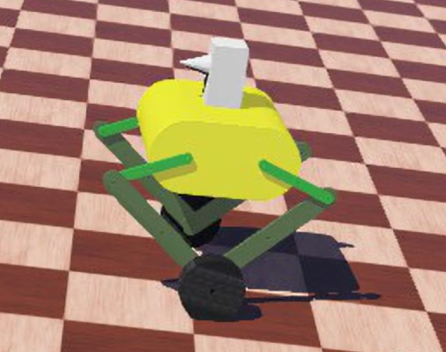
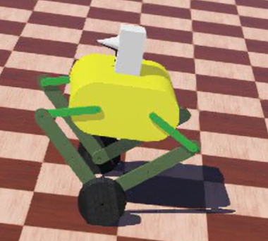
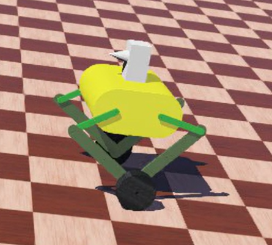
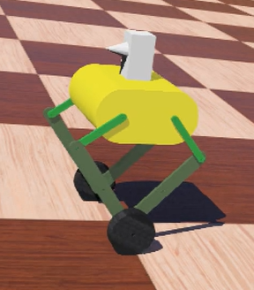
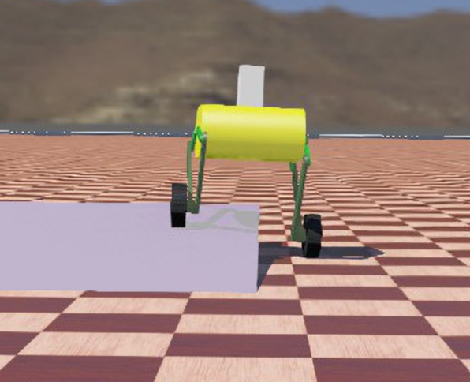

# webots-short
---
## Introduction 
The simulation of jump-able legged which modified from the open source model of ARX, the main work is the controller design

---
## Directory
* [1. 功能展示](#1功能展示)
* [2. code](#2code)
* [3. TBD](#2TBD)

---

## 1.功能展示
### 1.1 平衡
 

<!--  -->

 

### 1.2 轮腿解算
 

<!-- 
 -->
  

 

### 1.3 高度控制
 

<!--  -->

 

### 1.4 roll轴平衡
 

<!--  -->

 

---
## 2.code

 

|代码    |  功能   |
| ------- | ------ |
|app |软件层
|bsp |硬件层
|math |数学算法层

 

---
## 3.TBD
 

|功能与算法      |  状态   |
| ------- | ------ |
|直立平衡环 |已完成
|轮腿解算 |已完成
|键盘控制 |已完成
|前进后退 |已完成
|差速旋转 |已完成
|高度调节 |已完成
|roll轴平衡环 |已完成
|原地跳跃 |初步实验已完成，待改进
|整车速度环 |待更新（目前直接控制重心角度）
|飞坡 |待更新

**位控功能初步实现后考虑力控实现**

 
